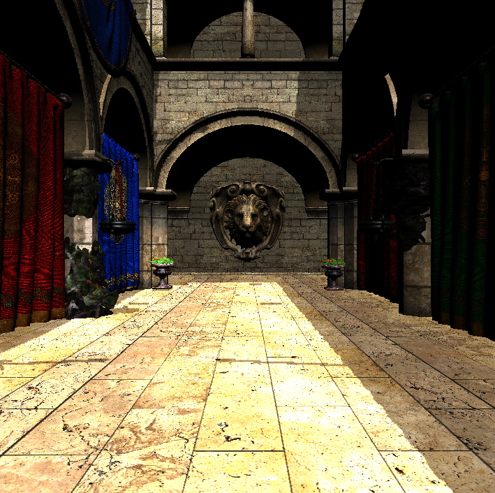

# Little Renderer
It is my prace renderer for Hybrid ray tracing with Vulkan API.
This proejct works on both Windows & Android platform.




## Windows

### Requirements
- Visual Studio 2022
- VulkanSDK (with VULKAN_SDK as a system environment)

To generate Visual studio project solution, run

```
> GenerateProject.bat
```

To compile glsl shaders, run

```
> CompileShaders.bat
```

## Android
### Requirements
- Android Studio
- VulkanSDK (with VULKAN_SDK as a system environment)


